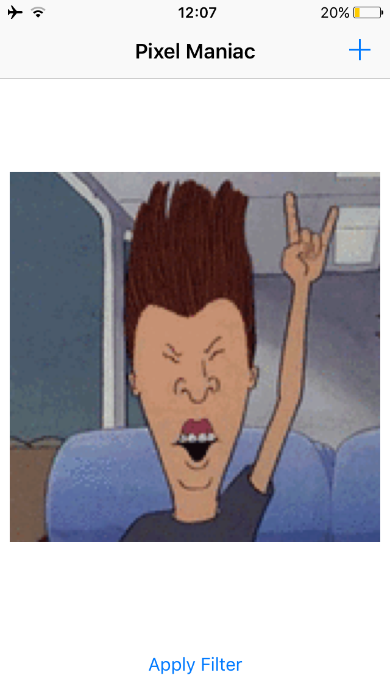
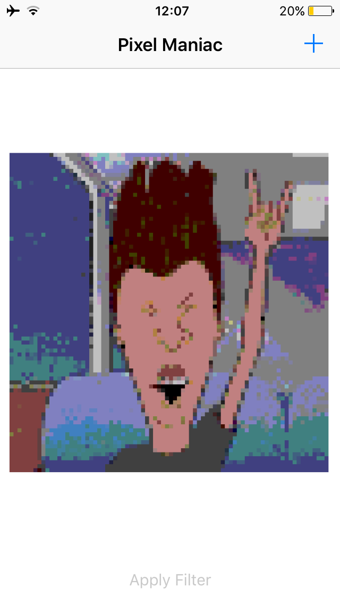

# Pixel Maniac
Image Filter demo app using Core Image and [GPUImage Framwork](https://github.com/BradLarson/GPUImage). 

It was coded in Swift 2.0 - Xcode 7.0.

| Before| After |
|-------|-------|
|||

## Missing Features
* Add share button in somewhere after filtering image.

